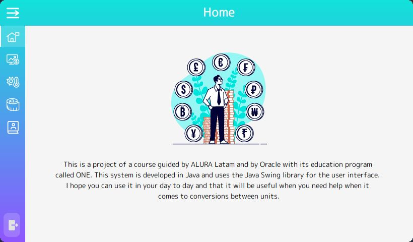

# ALURA CONVERTER :currency_exchange:

 

This is a project :building_construction: of a course guided by *ALURA Latam* :earth_americas: and by *Oracle* :coffee: with its education program called *ONE* :books:.

This system is developed in **Java** :coffee: and uses the Java Swing library :books: for the user interface :computer:.

I hope :metal: you can use it in your day to day :city_sunset: and that it will be **useful** :hammer_and_wrench: *when you need help when it comes to conversions between units :straight_ruler:*.

 

## What units can I convert?

You can make conversions between the different options that we will describe:

 

### Currencies

With this converter you can convert amounts of money :money_with_wings: between different currencies :heavy_dollar_sign: from around the **world** :earth_americas:.

To do this, we use an external **API** :cloud: provided by [*ExchangeRate API*](exchangerate-api.com) who offer a wide variety of currencies :chart: to exchange and convert amounts of money. This **API** updates :arrows_counterclockwise: its information every day, so it is up to date.

---

### Temperature

You can convert temperatures :thermometer: into *Celsius*, *Fahrenheit* and *Kelvin*.

These calculations are also carried out internally by the program since they are formulas that were created many years ago and do not change.

---

### Length units

You can convert units of length :triangular_ruler: into other units that we have available for now. The calculations of these units are carried out internally by the program because they are constants that do not change unlike currencies.

 

## Demonstration of use

The following is a *gift* :film_projector: where you can see how the converter works, each of its functions and views that it has :battery:.

 

 

## About view

The program has a section where you can find my social networks :world_map: and you can contact me :mailbox_with_mail: if something happens while using the converter :rocket: or if you have any suggestions or something to tell me :speaking_head:.

 

 

## First Release has been uploaded :rocket::tada:

This version is **1.0-beta** :space_invader: of *Alura Converter* :currency_exchange: and has the following features :white_check_mark::

- *Currency* converter with an API :money_with_wings:.
- *Length unit* converter :straight_ruler:.
- *Temperature* converter :thermometer:.

You can download the **.jar** file :coffee: and use it directly on your computer :computer: if you have installed the **JVM** :robot:.